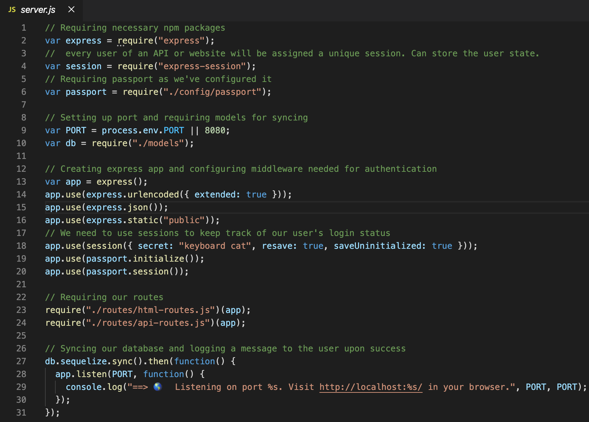
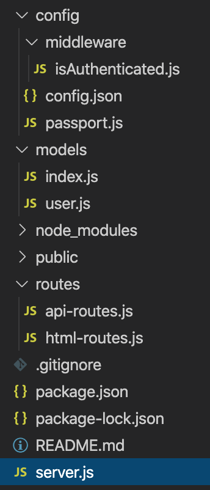
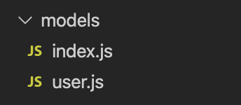
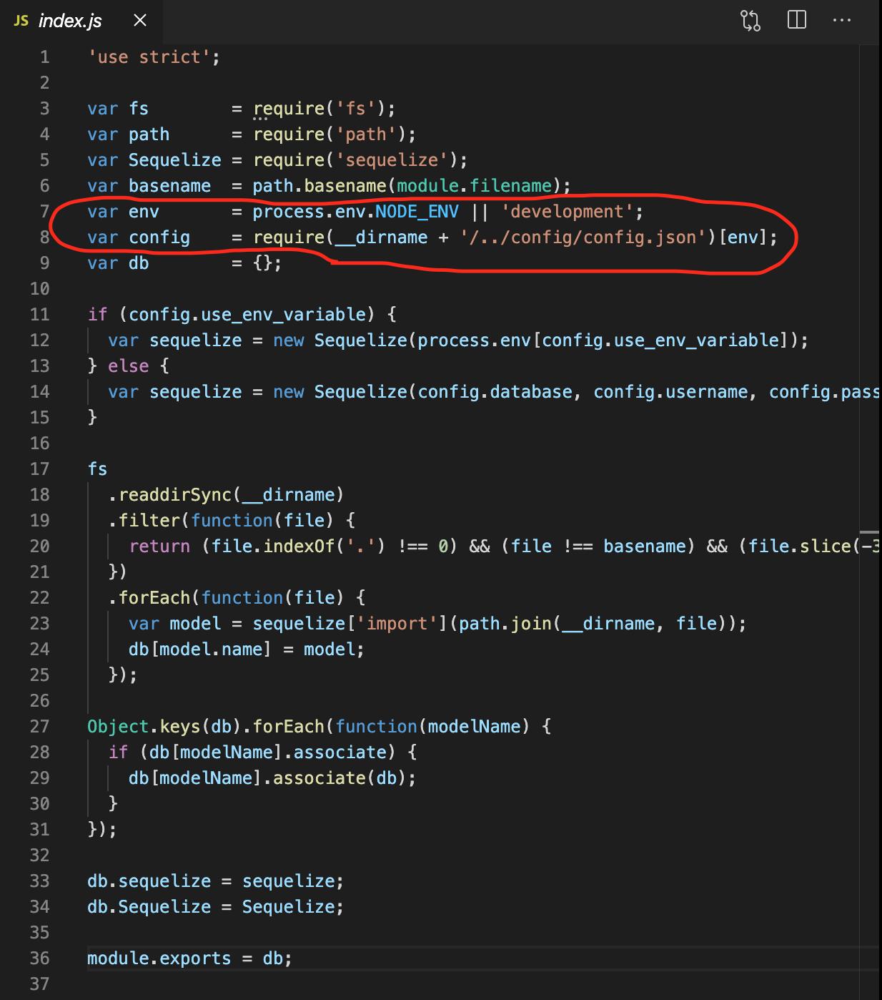
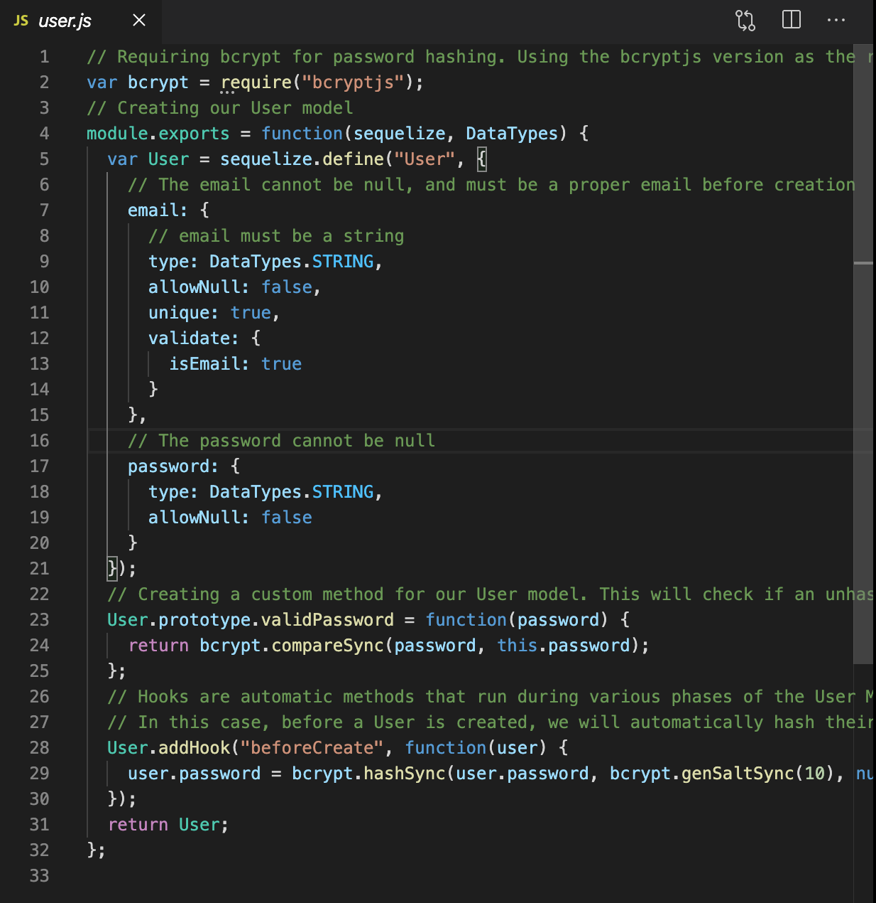
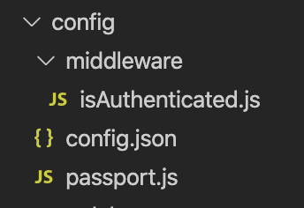
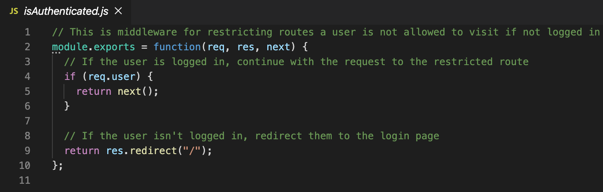
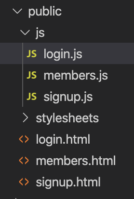

# code-review-tutorial
In this exercise, I reviewed the code files in the repo above and provide a walkthrough tutorial here for a teachback on how this codebase functions. The purpose of the application is to showcase the passport authentication module 

## server.js

This is a file in the root folder and is the script you run to start up the server, so any issues here will mess up the flow of your app. Thus this file is a good place to start. 

Lines 1-6 list out our dependicies and use the 'require' function. Line 2, requires express framework on top of node and makes the coding the server processes a lot easy.  The next two requires modules are new to me:  

```
var session = require("express-session");
var passport = require("./config/passport");
```

Looking up the documentation on express-session I discovered it is a module that assigns every user a unique session that can store the user state. This is related to the next require for 'passport' on line 6, which is an authentication libary that allows for users to sign in. 

Lines 9-10 set up our port for our server, either hosted remotely using the "process.env.PORT' or falling back to a local deployment on port 8080. 

Lines 13-20 create the express app and configure middleware needed for authentication. This is typically starter code and reused for each work project. The `app.use(express.static("public"));` provides a public folder for general access if hosted in a cloud provider such as Heroku.

Lines 18-20 are related to the new authentication Passport module and keep track of the users's login status. 

Lines 23-24 require our our html and server routes stored in the "routes" folder. 

Lines 27-31 is starter code that syncs the database and displays a message to the user when they successfully start the server. In the console you run node server.js and hopefully you see the console log meessage on line 29 run in the terminal. 

**Decision point**

Looking at the server.js file overall there are a few places we could go next. Line 6 points us to the config folder to look at the passport file `var passport = require("./config/passport");` and lines 23-24 point us to the routes folder and a third pathway is line 10 which establishes a var db that points to the "models" folder. This tutorial will eventually get to all the files but here I'll start out by looking at the models folder.


## Models folder

Inside this folder we have two files index.js and user.js

*index.js*


Lines 3-5 require moduls file server ("fs"), path (for reading file paths) and establishing sequelize with will perform the function of our ORM and make writing SQL queries much easier. 

Line 7 establishes a var basename that points to `path.basename(module.filename);` which is a method that returns the filename part of a file path. We use it later on line 26 to check that .js file exists in the directory. 

Line 8-10 are shortcut varaibles for pointing to starter code for connecting to our database and extracting the details from the config.json file. The config.json file will have details such as databse name, username, and database password etc. Line 10 creates an empty object that we will use to create models off this starter template and then export for other files to use as writte down in line 43

Lines 14-19 Determines which database to use depending on whether we are deployed in the cloud or running a local instance. Denpending on the true/false of the conditional statement the `var sequelize = new Sequelize` will create a model either in the remote database or the local databse using the details form the config.json file. 

Line 22-31 this checks our folder to make sure that there isn't a gitignore file and the we aren't looking at the current file and only the files that end with `.js`. 

Line 36 exports our db for other files to use

*user.js*


This is a sequelize template for a User model. 

Line 2 we require the bcryptjs library for password hashing.

Line 4-25 we export our User model and create two colums (email and password) on lines 7 and 17. 

Line 9 `type: DataTypes.STRING` forces the datatype for email column (in line 7) to be a string
Line 10 `allowNull: false` prevents the column for email from being empty or null
Line 11 `unique: true` ensures that each email in the column is unique and not reused
Line 12-15 is a validator of the information the user entered `isEmail` check to make sure the user input matches the general email formate of name@provider.com.

line 23-25 Creates a custom method for User model that will check passwords from the user to what we have stored in the database.

Line 28-30 Hooks are automatic methods that run during various phases of the User Model lifecycle, in this case, before a User is created, we will automatically hash their password.

Line 31 Returns the user object for other files to use

## Routes folder

Within this folder we have two files api-routes.js and html-routes.js

*api-routes.js*

Lines 2-3 we require our models folder and passport configuration located within the config folder.

Line 5 we export the module as a function that receives the express app as an argument. This is done on the server.js page on line 24

Line 9-11 A post route named `/api/login` is established and uses the local strategy (using email and password) to authenticate on passport. A passport strategy is the method you will use to authenticate a user. Other strategies include Facebook, OAuth, Twitter which use those federated authentication methods. This post method then returns a json object with `req.user`. A list of strategies for passport can be found [Passport-Strategies](http://www.passportjs.org/packages/)

Line 16-28 is another post route named `/api/signup` that uses the sequelize method create to add email and password to the User table. Then the user is redirected to the `/api/login` page on line 22. If authentication fails the user is deliverd a 401 error shown on line 26. 

Line 31-34 is a get route on `/logout` that redirects user to the home page on the `/` route. 

Line 37-50 is a another get route that sends back data about our user to the client side. If the `req.user` is empty then our user is not logged in and an empty object is sent back as indicated on line 40 in the `res.json({});` code. Otherwise the user email and id are returned. 

*html-routes.js*

line 2 is the path module dependency so we can use relatiev routes to our HTML files

line 5 is middleware fo checking if a user is logged in and we will take a look at the file isAuthenticated under the config folder later.

line 9-15 a get route that redirects users who already have an account to the `/members` page. Otherwise, they are directed to the signup html page

line 17-23 get route on the `/login` that redirets user with an account to `/members`. Otherwise sends them to the login.html page.

line 27-31  Here we've add our isAuthenticated middleware to the `/members` route. If a user who is not logged in tries to access this route they will be redirected to the signup page. 

```
app.get("/members", isAuthenticated, function(req, res) {
    res.sendFile(path.join(__dirname, "../public/members.html"));
  });
```
## Config folder


*isAuthenticated.js*


This short script (lines 2-10) is middleware for restricting routes a user is not allowed to visit if not logged in. If the user is logged in, continue with the request to the restricted route. If the user isn't logged in, redirect them to the login page.

*config.json*

contains the local credentials for the local database

*passport.js*

Line 1-4 Our dependencies and the local startegy "passport-local" module. In other words, we want login with a username/email and password. We also require the models folder for the db variable on line 4. 

Line 10 Our user will sign in with an email as a key 

Line 12-17 A sequelize entry to check if a user has an email within our database 
```
function(email, password, done) {
    db.User.findOne({
      where: {
        email: email
      }
```
Line 18-23 A conditional if statement to check if there is no user for the database. If so, then return out fo the program with the message "Incorrect email."

Line 26-33 Else if conditional statement following the if statment above that uses the Passport library to cehck for the correct password. If in correct messages the user. 
```
 else if (!dbUser.validPassword(password)) {
        return done(null, false, {
          message: "Incorrect password."
        });
      }
      // If none of the above, return the user
      return done(null, dbUser);
    });
```

Line 40-46 Boilerplate needed to serialize user across HTTP requrests

Line 49 exports the passport module for other files to use

## Public folder 


*html files*

Here we have matching files in the js subfolder and the parent public folder. The html file (login, members, and signup) are relatively straight forward html files with form elements for the login. Each html sheet has a corresponding js file as indicated in the bottom of each file. For example, at the bottom of the signup.html is a src to the signup.js

`<script type="text/javascript" src="js/signup.js"></script>`

*js files*

These files have the jQuery on click listeners and html routes from the client side. The lines 1-4 on login.js have references to the forms on the associated html files and input lines. 

```
$(document).ready(function() {
  var loginForm = $("form.login");
  var emailInput = $("input#email-input");
  var passwordInput = $("input#password-input");
```
Lines 8-17 Validate that there is an email and password entered in the form
```
loginForm.on("submit", function(event) {
    event.preventDefault();
    var userData = {
      email: emailInput.val().trim(),
      password: passwordInput.val().trim()
    };

    if (!userData.email || !userData.password) {
      return;
    }
```

Lines 20-23 If we have an email and password we run the loginUser function and clear the form.

```
loginUser(userData.email, userData.password);
    emailInput.val("");
    passwordInput.val("");
  });
```
Lines 26-37 Here the function loginUser does a post to api/login route and if successful redirects the user to the members page

```
function loginUser(email, password) {
    $.post("/api/login", {
      email: email,
      password: password
    })
      .then(function() {
        window.location.replace("/members");
        // If there's an error, log the error
      })
      .catch(function(err) {
        console.log(err);
      });
```


#### Author Links
[LinkedIn](linkedin.com/in/joel-mathen/)


